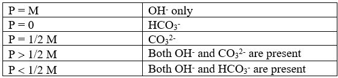

### **Introduction**

Pure water is neutral in nature with pH 7. Due to the presence of dissolved minerals in rainwater, the pH increases and becomes alkaline. The alkaline nature of water is due to the presence of hydroxide (OH⁻), carbonate (CO₃²⁻) and bicarbonate (HCO₃⁻) ions. The alkalinity contributed by these ions is estimated by titrating the water sample against a standard acid solution using phenolphthalein and methyl orange indicators successively.On reaction with acid, hydroxide ions are completely neutralized to water, and the endpoint for this reaction is determined by the phenolphthalein indicator (one-step neutralization):

OH− + H+ → H2O &nbsp; Eqn. (1)

Since neutralization of carbonate ions is a two-step reaction, in the first step, carbonate ions are neutralized to bicarbonate ions and completion of this step is indicated by phenolphthalein (pH 8.3–10). The bicarbonates formed further react with acid in a second step to form water and CO₂, and this endpoint is determined by the methyl orange indicator (pH 3.1–4.4):

CO32− + H+ → HCO3− &nbsp; Eqn. (2)

HCO3− + H+ → H2O + CO2 ↑&nbsp; Eqn. (3)

Further, alkalinity due to bicarbonate ions is neutralized completely in a single step, and the endpoint is determined by the methyl orange indicator:

HCO3− + H+ → H2O + CO2 ↑ &nbsp; Eqn. (4)

These three reactions can be summarized as shown below:

  

Here P and M represents alkalinity determined by phenolphthalein and methyl orange indicators, respectively. It is important to note that in water hydroxide and bicarbonate ions cannot exist together because both reacts with each other according to the following reaction:-

OH− + HCO3− → H2O + CO32−

So, there exist five different possibilities of alkalinity in water on the basis of concentrations of various ions in water as tabulated in the table-

  

Here:  
P = alkalinity measured by phenolphthalein end point  
M = alkalinity measured by methyl orange end point  

### **Applications:**
1.Water Treatment Optimization 
2.Environmental Monitoring 
3.Industrial Processes 
4.Drinking Water Quality 
5.Research and Education

